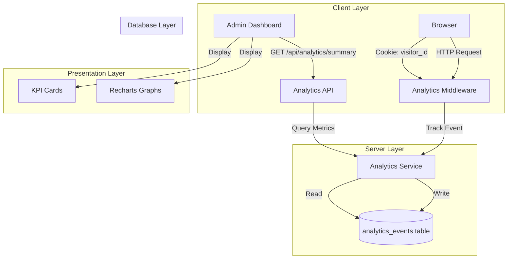

# Design Document - Analytics de Tráfego

## Overview

O sistema de Analytics de Tráfego será implementado como uma extensão do dashboard administrativo existente do TikJogos. A solução utiliza rastreamento baseado em cookies persistentes para distinguir visitantes únicos de pageviews, armazena eventos no PostgreSQL via Drizzle ORM, e apresenta métricas através de uma interface visual com cards KPI e gráficos temporais usando Recharts.

A arquitetura segue os padrões já estabelecidos no projeto: middleware Express para captura automática, API REST para consultas, e componentes React com React Query para gerenciamento de estado do servidor.

## Architecture

### High-Level Architecture



### Data Flow

**Tracking Flow (Pageview Registration):**
1. User accesses any page → Express middleware intercepts request
2. Middleware checks for `visitor_id` cookie
3. If cookie absent → Generate UUID → Set cookie (365 days) → Mark as `unique_visitor`
4. If cookie present → Mark as `pageview`
5. Extract metadata (IP, user-agent, path, timestamp)
6. Async insert into `analytics_events` table
7. Continue request processing (non-blocking)

**Query Flow (Dashboard Metrics):**
1. Admin opens `/dashadmin` → Navigates to Analytics tab
2. React component mounts → React Query fetches `/api/analytics/summary`
3. API executes optimized SQL queries with date grouping
4. Returns JSON with totals and 30-day time series
5. Frontend distributes data to KPI cards and Recharts components
6. React Query caches response for 5 minutes

### Technology Stack Integration

**Backend:**
- Express.js middleware for automatic tracking
- Drizzle ORM for type-safe database operations
- PostgreSQL for persistent storage
- Existing `verifyAdmin` middleware for route protection

**Frontend:**
- React 19 with functional components and hooks
- Wouter for routing (add `/dashadmin/analytics` route)
- React Query for server state management
- Recharts for data visualization
- Radix UI components (Card, Skeleton, etc.)
- Tailwind CSS for styling

**Database:**
- Neon serverless PostgreSQL (Replit environment)
- Standard pg driver (Railway/production)
- Drizzle Kit for migrations

## Components and Interfaces

### 1. Database Schema

**Table: analytics_events**

```typescript
// shared/schema.ts
export const analyticsEvents = pgTable(
  "analytics_events",
  {
    id: varchar("id").primaryKey().default(sql`gen_random_uuid()`),
    visitorId: varchar("visitor_id", { length: 36 }).notNull(),
    eventType: varchar("event_type", { length: 20 }).notNull(), // 'unique_visitor' | 'pageview'
    ipAddress: varchar("ip_address", { length: 45 }), // IPv6 support
    userAgent: text("user_agent"),
    pagePath: varchar("page_path", { length: 500 }),
    referrer: varchar("referrer", { length: 500 }),
    createdAt: timestamp("created_at").notNull().defaultNow(),
  },
  (table) => [
    index("idx_analytics_visitor_id").on(table.visitorId),
    index("idx_analytics_event_type").on(table.eventType),
    index("idx_analytics_created_at").on(table.createdAt),
  ]
);

export type AnalyticsEvent = typeof analyticsEvents.$inferSelect;
export type InsertAnalyticsEvent = typeof analyticsEvents.$inferInsert;
```

**Indexes Rationale:**
- `visitor_id`: Fast lookups for unique visitor counting
- `event_type`: Efficient filtering by event type
- `created_at`: Optimized date range queries for time series

### 2. Backend Components

#### Analytics Middleware

```typescript
// server/analyticsMiddleware.ts
import { Request, Response, NextFunction } from 'express';
import { db } from './db';
import { analyticsEvents } from '@shared/schema';
import { randomUUID } from 'crypto';

const COOKIE_NAME = 'visitor_id';
const COOKIE_MAX_AGE = 365 * 24 * 60 * 60 * 1000; // 365 days

// Paths to ignore (static assets, API health checks)
const IGNORE_PATHS = [
  /\.(js|css|png|jpg|jpeg|gif|svg|ico|woff|woff2|ttf|eot)$/i,
  /^\/api\/health/,
  /^\/api\/version/,
];

export function analyticsMiddleware(req: Request, res: Response, next: NextFunction) {
  // Skip tracking for ignored paths
  if (IGNORE_PATHS.some(pattern => pattern.test(req.path))) {
    return next();
  }

  // Extract or create visitor ID
  let visitorId = req.cookies[COOKIE_NAME];
  let eventType: 'unique_visitor' | 'pageview' = 'pageview';

  if (!visitorId) {
    visitorId = randomUUID();
    eventType = 'unique_visitor';
    
    res.cookie(COOKIE_NAME, visitorId, {
      maxAge: COOKIE_MAX_AGE,
      httpOnly: false, // Allow client-side reading
      secure: process.env.NODE_ENV === 'production',
      sameSite: 'lax',
    });
  }

  // Extract metadata
  const ipAddress = extractRealIP(req);
  const userAgent = req.headers['user-agent'] || null;
  const pagePath = req.path;
  const referrer = req.headers['referer'] || null;

  // Async tracking (non-blocking)
  trackEvent({
    visitorId,
    eventType,
    ipAddress,
    userAgent,
    pagePath,
    referrer,
  }).catch(err => {
    console.error('[Analytics] Failed to track event:', err);
  });

  next();
}

function extractRealIP(req: Request): string | null {
  return (
    (req.headers['x-forwarded-for'] as string)?.split(',')[0]?.trim() ||
    (req.headers['x-real-ip'] as string) ||
    req.socket.remoteAddress ||
    null
  );
}

async function trackEvent(data: Omit<InsertAnalyticsEvent, 'id' | 'createdAt'>) {
  if (!db) {
    console.warn('[Analytics] Database not available, skipping tracking');
    return;
  }

  await db.insert(analyticsEvents).values(data);
}
```

#### Analytics API Routes

```typescript
// server/analyticsRoutes.ts
import { Router } from 'express';
import { db } from './db';
import { analyticsEvents } from '@shared/schema';
import { sql, desc, count, countDistinct } from 'drizzle-orm';
import { verifyAdmin } from './routes'; // Reuse existing admin middleware

const router = Router();

// GET /api/analytics/summary
router.get('/summary', verifyAdmin, async (req, res) => {
  try {
    if (!db) {
      return res.status(503).json({ error: 'Database not available' });
    }

    // Total pageviews (all events)
    const totalPageviewsResult = await db
      .select({ count: count() })
      .from(analyticsEvents);
    const totalPageviews = totalPageviewsResult[0]?.count || 0;

    // Total unique visitors (distinct visitor_id where event_type = 'unique_visitor')
    const totalUniqueVisitorsResult = await db
      .select({ count: countDistinct(analyticsEvents.visitorId) })
      .from(analyticsEvents)
      .where(sql`${analyticsEvents.eventType} = 'unique_visitor'`);
    const totalUniqueVisitors = totalUniqueVisitorsResult[0]?.count || 0;

    // Last 30 days pageviews (grouped by date)
    const thirtyDaysAgo = new Date();
    thirtyDaysAgo.setDate(thirtyDaysAgo.getDate() - 30);

    const pageviewsLast30Days = await db
      .select({
        date: sql<string>`DATE(${analyticsEvents.createdAt})`,
        count: count(),
      })
      .from(analyticsEvents)
      .where(sql`${analyticsEvents.createdAt} >= ${thirtyDaysAgo}`)
      .groupBy(sql`DATE(${analyticsEvents.createdAt})`)
      .orderBy(sql`DATE(${analyticsEvents.createdAt})`);

    // Last 30 days unique visitors (grouped by date)
    const uniqueVisitorsLast30Days = await db
      .select({
        date: sql<string>`DATE(${analyticsEvents.createdAt})`,
        count: countDistinct(analyticsEvents.visitorId),
      })
      .from(analyticsEvents)
      .where(
        sql`${analyticsEvents.createdAt} >= ${thirtyDaysAgo} AND ${analyticsEvents.eventType} = 'unique_visitor'`
      )
      .groupBy(sql`DATE(${analyticsEvents.createdAt})`)
      .orderBy(sql`DATE(${analyticsEvents.createdAt})`);

    // Fill missing dates with zero counts
    const pageviewsTimeSeries = fillMissingDates(pageviewsLast30Days, 30);
    const uniqueVisitorsTimeSeries = fillMissingDates(uniqueVisitorsLast30Days, 30);

    res.json({
      totalPageviews,
      totalUniqueVisitors,
      pageviewsLast30Days: pageviewsTimeSeries,
      uniqueVisitorsLast30Days: uniqueVisitorsTimeSeries,
    });
  } catch (error) {
    console.error('[Analytics API] Error fetching summary:', error);
    res.status(500).json({ error: 'Failed to fetch analytics data' });
  }
});

// Helper function to fill missing dates
function fillMissingDates(
  data: Array<{ date: string; count: number }>,
  days: number
): Array<{ date: string; count: number }> {
  const result: Array<{ date: string; count: number }> = [];
  const dataMap = new Map(data.map(d => [d.date, d.count]));

  for (let i = days - 1; i >= 0; i--) {
    const date = new Date();
    date.setDate(date.getDate() - i);
    const dateStr = date.toISOString().split('T')[0];
    result.push({
      date: dateStr,
      count: dataMap.get(dateStr) || 0,
    });
  }

  return result;
}

export default router;
```

#### Integration into Main Server

```typescript
// server/index.ts (modifications)
import analyticsMiddleware from './analyticsMiddleware';
import analyticsRoutes from './analyticsRoutes';
import cookieParser from 'cookie-parser'; // Need to add this dependency

// ... existing imports

app.use(cookieParser()); // Add before routes
app.use(analyticsMiddleware); // Add after cookieParser, before routes

// ... existing routes

app.use('/api/analytics', analyticsRoutes);
```

### 3. Frontend Components

#### Analytics Dashboard Page

```typescript
// client/src/pages/AnalyticsDashboard.tsx
import { useQuery } from '@tanstack/react-query';
import { Card, CardContent, CardHeader, CardTitle } from '@/components/ui/card';
import { Skeleton } from '@/components/ui/skeleton';
import { BarChart3, Users, Eye, TrendingUp } from 'lucide-react';
import { AnalyticsChart } from '@/components/AnalyticsChart';
import { apiRequest } from '@/lib/queryClient';

type AnalyticsSummary = {
  totalPageviews: number;
  totalUniqueVisitors: number;
  pageviewsLast30Days: Array<{ date: string; count: number }>;
  uniqueVisitorsLast30Days: Array<{ date: string; count: number }>;
};

export default function AnalyticsDashboard() {
  const { data, isLoading, error } = useQuery<AnalyticsSummary>({
    queryKey: ['/api/analytics/summary'],
    queryFn: () => apiRequest('/api/analytics/summary'),
    staleTime: 5 * 60 * 1000, // 5 minutes cache
    refetchOnWindowFocus: false,
  });

  if (isLoading) {
    return <AnalyticsLoadingSkeleton />;
  }

  if (error) {
    return (
      <div className="p-6">
        <Card className="border-destructive">
          <CardContent className="pt-6">
            <p className="text-destructive">
              Erro ao carregar dados de analytics. Tente novamente mais tarde.
            </p>
          </CardContent>
        </Card>
      </div>
    );
  }

  return (
    <div className="p-6 space-y-6">
      <div className="flex items-center gap-2">
        <BarChart3 className="h-8 w-8" />
        <h1 className="text-3xl font-bold">Analytics de Tráfego</h1>
      </div>

      {/* KPI Cards */}
      <div className="grid grid-cols-1 md:grid-cols-2 gap-6">
        <Card>
          <CardHeader className="flex flex-row items-center justify-between space-y-0 pb-2">
            <CardTitle className="text-sm font-medium">Total de Pageviews</CardTitle>
            <Eye className="h-4 w-4 text-muted-foreground" />
          </CardHeader>
          <CardContent>
            <div className="text-4xl font-bold">
              {data?.totalPageviews.toLocaleString('pt-BR')}
            </div>
            <p className="text-xs text-muted-foreground mt-1">
              Todas as visualizações de página
            </p>
          </CardContent>
        </Card>

        <Card>
          <CardHeader className="flex flex-row items-center justify-between space-y-0 pb-2">
            <CardTitle className="text-sm font-medium">Visitantes Únicos</CardTitle>
            <Users className="h-4 w-4 text-muted-foreground" />
          </CardHeader>
          <CardContent>
            <div className="text-4xl font-bold">
              {data?.totalUniqueVisitors.toLocaleString('pt-BR')}
            </div>
            <p className="text-xs text-muted-foreground mt-1">
              Visitantes identificados por cookie
            </p>
          </CardContent>
        </Card>
      </div>

      {/* Charts */}
      <div className="grid grid-cols-1 gap-6">
        <Card>
          <CardHeader>
            <CardTitle>Pageviews - Últimos 30 Dias</CardTitle>
          </CardHeader>
          <CardContent>
            <AnalyticsChart
              data={data?.pageviewsLast30Days || []}
              dataKey="count"
              color="#8884d8"
            />
          </CardContent>
        </Card>

        <Card>
          <CardHeader>
            <CardTitle>Visitantes Únicos - Últimos 30 Dias</CardTitle>
          </CardHeader>
          <CardContent>
            <AnalyticsChart
              data={data?.uniqueVisitorsLast30Days || []}
              dataKey="count"
              color="#82ca9d"
            />
          </CardContent>
        </Card>
      </div>
    </div>
  );
}

function AnalyticsLoadingSkeleton() {
  return (
    <div className="p-6 space-y-6">
      <Skeleton className="h-10 w-64" />
      <div className="grid grid-cols-1 md:grid-cols-2 gap-6">
        <Skeleton className="h-32" />
        <Skeleton className="h-32" />
      </div>
      <div className="grid grid-cols-1 gap-6">
        <Skeleton className="h-80" />
        <Skeleton className="h-80" />
      </div>
    </div>
  );
}
```

#### Reusable Chart Component

```typescript
// client/src/components/AnalyticsChart.tsx
import {
  LineChart,
  Line,
  XAxis,
  YAxis,
  CartesianGrid,
  Tooltip,
  ResponsiveContainer,
} from 'recharts';
import { format, parseISO } from 'date-fns';
import { ptBR } from 'date-fns/locale';

type AnalyticsChartProps = {
  data: Array<{ date: string; count: number }>;
  dataKey: string;
  color: string;
};

export function AnalyticsChart({ data, dataKey, color }: AnalyticsChartProps) {
  if (!data || data.length === 0) {
    return (
      <div className="h-64 flex items-center justify-center text-muted-foreground">
        Nenhum dado disponível ainda
      </div>
    );
  }

  // Format data for Recharts
  const formattedData = data.map(item => ({
    ...item,
    dateFormatted: format(parseISO(item.date), 'dd/MM', { locale: ptBR }),
  }));

  return (
    <ResponsiveContainer width="100%" height={300}>
      <LineChart data={formattedData}>
        <CartesianGrid strokeDasharray="3 3" />
        <XAxis
          dataKey="dateFormatted"
          tick={{ fontSize: 12 }}
          interval="preserveStartEnd"
        />
        <YAxis tick={{ fontSize: 12 }} />
        <Tooltip
          contentStyle={{
            backgroundColor: 'hsl(var(--card))',
            border: '1px solid hsl(var(--border))',
            borderRadius: '6px',
          }}
          labelFormatter={(label) => `Data: ${label}`}
          formatter={(value: number) => [value.toLocaleString('pt-BR'), 'Contagem']}
        />
        <Line
          type="monotone"
          dataKey={dataKey}
          stroke={color}
          strokeWidth={2}
          dot={{ r: 3 }}
          activeDot={{ r: 5 }}
        />
      </LineChart>
    </ResponsiveContainer>
  );
}
```

#### Integration into Admin Dashboard

```typescript
// client/src/pages/AdminDashboard.tsx (modifications)
import { Tabs, TabsContent, TabsList, TabsTrigger } from "@/components/ui/tabs";
import AnalyticsDashboard from "./AnalyticsDashboard";
import { BarChart3 } from "lucide-react";

// Inside the main component, add a new tab:
<Tabs defaultValue="stats" className="w-full">
  <TabsList className="grid w-full grid-cols-4">
    <TabsTrigger value="stats">
      <Home className="mr-2 h-4 w-4" />
      Estatísticas
    </TabsTrigger>
    <TabsTrigger value="rooms">
      <Users className="mr-2 h-4 w-4" />
      Salas
    </TabsTrigger>
    <TabsTrigger value="themes">
      <FileText className="mr-2 h-4 w-4" />
      Temas
    </TabsTrigger>
    <TabsTrigger value="analytics">
      <BarChart3 className="mr-2 h-4 w-4" />
      Analytics
    </TabsTrigger>
  </TabsList>

  {/* Existing tabs... */}

  <TabsContent value="analytics">
    <AnalyticsDashboard />
  </TabsContent>
</Tabs>
```

## Data Models

### Analytics Event Model

```typescript
type AnalyticsEvent = {
  id: string;                    // UUID primary key
  visitorId: string;             // UUID from cookie
  eventType: 'unique_visitor' | 'pageview';
  ipAddress: string | null;      // IPv4 or IPv6
  userAgent: string | null;      // Browser user agent
  pagePath: string | null;       // Requested path (e.g., "/blog/post-1")
  referrer: string | null;       // HTTP Referer header
  createdAt: Date;               // Event timestamp (UTC)
};
```

### API Response Model

```typescript
type AnalyticsSummary = {
  totalPageviews: number;        // Total count of all events
  totalUniqueVisitors: number;   // Distinct visitor_id count
  pageviewsLast30Days: Array<{
    date: string;                // ISO date string (YYYY-MM-DD)
    count: number;               // Pageviews for that day
  }>;
  uniqueVisitorsLast30Days: Array<{
    date: string;                // ISO date string (YYYY-MM-DD)
    count: number;               // Unique visitors for that day
  }>;
};
```

## Error Handling

### Backend Error Handling

1. **Database Connection Failures:**
   - Middleware checks `if (!db)` before tracking
   - Logs warning and continues request processing
   - API returns 503 Service Unavailable if database unavailable

2. **Tracking Failures:**
   - Wrapped in try-catch with async error handling
   - Errors logged to console but don't block user requests
   - Graceful degradation: site continues working without analytics

3. **Query Failures:**
   - API catches all database errors
   - Returns 500 Internal Server Error with generic message
   - Detailed error logged server-side for debugging

4. **Invalid Data:**
   - Drizzle schema validation prevents invalid inserts
   - TypeScript types ensure type safety
   - SQL injection prevented by parameterized queries

### Frontend Error Handling

1. **API Request Failures:**
   - React Query automatically retries failed requests (3 times)
   - Error state displayed in UI with user-friendly message
   - No crash: other dashboard features remain functional

2. **Missing Data:**
   - Empty arrays handled gracefully in charts
   - "Nenhum dado disponível" message shown
   - Zero counts displayed for missing dates

3. **Loading States:**
   - Skeleton loaders during data fetch
   - Prevents layout shift
   - Improves perceived performance

## Testing Strategy

### Unit Tests

**Backend:**
1. `analyticsMiddleware.test.ts`
   - Test cookie creation for new visitors
   - Test cookie reading for returning visitors
   - Test IP extraction from various headers
   - Test path filtering (ignore static assets)
   - Test async tracking doesn't block response

2. `analyticsRoutes.test.ts`
   - Test `/api/analytics/summary` returns correct structure
   - Test date range calculations (30 days)
   - Test missing date filling logic
   - Test admin authentication requirement
   - Test error handling for database failures

3. `analyticsService.test.ts`
   - Test event insertion with valid data
   - Test handling of null/undefined values
   - Test database unavailability scenarios

**Frontend:**
1. `AnalyticsDashboard.test.tsx`
   - Test loading state renders skeleton
   - Test error state displays error message
   - Test successful data render shows cards and charts
   - Test number formatting (thousands separators)

2. `AnalyticsChart.test.tsx`
   - Test empty data shows placeholder message
   - Test chart renders with valid data
   - Test date formatting (DD/MM)
   - Test tooltip displays correct values

### Integration Tests

1. **End-to-End Tracking Flow:**
   - Simulate first visit → Verify cookie set → Verify unique_visitor event
   - Simulate return visit → Verify cookie read → Verify pageview event
   - Verify events stored in database with correct data

2. **API Integration:**
   - Seed database with test events
   - Call `/api/analytics/summary`
   - Verify response matches expected aggregations
   - Verify 30-day time series includes all dates

3. **Dashboard Integration:**
   - Mock API responses
   - Render AnalyticsDashboard
   - Verify KPI cards display correct numbers
   - Verify charts render with correct data

### Manual Testing Checklist

- [ ] First visit creates cookie and tracks unique_visitor
- [ ] Return visit reads cookie and tracks pageview
- [ ] Cookie persists across browser sessions
- [ ] Cookie expires after 365 days
- [ ] Static assets (JS, CSS, images) not tracked
- [ ] Admin dashboard displays analytics tab
- [ ] KPI cards show formatted numbers
- [ ] Charts display 30-day time series
- [ ] Charts handle empty data gracefully
- [ ] Mobile responsive layout works correctly
- [ ] Dark mode styling looks correct
- [ ] API requires admin authentication
- [ ] Database indexes improve query performance
- [ ] Tracking doesn't slow down page loads

### Performance Testing

1. **Load Testing:**
   - Simulate 1000 concurrent requests
   - Verify tracking doesn't increase response time significantly
   - Verify database can handle write load

2. **Query Performance:**
   - Measure `/api/analytics/summary` response time
   - Verify indexes are used (EXPLAIN ANALYZE)
   - Target: < 500ms response time

3. **Frontend Performance:**
   - Measure chart render time with 30 data points
   - Verify React Query caching reduces API calls
   - Target: < 100ms render time

## Security Considerations

1. **Cookie Security:**
   - `httpOnly: false` (required for client-side reading)
   - `secure: true` in production (HTTPS only)
   - `sameSite: 'lax'` (CSRF protection)
   - No sensitive data in cookie (only UUID)

2. **SQL Injection Prevention:**
   - Drizzle ORM uses parameterized queries
   - No raw SQL with user input
   - TypeScript types prevent invalid data

3. **Admin Authentication:**
   - Reuse existing `verifyAdmin` middleware
   - Bearer token required for all analytics API routes
   - No public access to analytics data

4. **IP Address Privacy:**
   - Store IP for fraud detection only
   - Consider anonymization (last octet zeroing)
   - Comply with GDPR/LGPD requirements

5. **Rate Limiting:**
   - Consider adding rate limiting to analytics API
   - Prevent abuse of admin endpoints
   - Use existing patterns if available

## Migration Strategy

1. **Database Migration:**
   ```bash
   npm run db:push
   ```
   - Drizzle Kit will create `analytics_events` table
   - Indexes created automatically
   - No data migration needed (new feature)

2. **Deployment Steps:**
   - Deploy backend changes first (middleware + API)
   - Verify tracking works in production
   - Deploy frontend changes (dashboard)
   - Monitor error logs for issues

3. **Rollback Plan:**
   - Remove middleware from `server/index.ts`
   - Remove analytics routes
   - Drop `analytics_events` table if needed
   - Frontend gracefully handles missing API

## Future Enhancements

1. **Advanced Metrics:**
   - Bounce rate calculation
   - Average session duration
   - Top pages by traffic
   - Referrer analysis

2. **Real-time Dashboard:**
   - WebSocket integration for live metrics
   - Active users counter
   - Real-time event stream

3. **Data Export:**
   - CSV export functionality
   - Date range filtering
   - Custom report generation

4. **Privacy Features:**
   - IP anonymization toggle
   - GDPR compliance tools
   - Cookie consent integration

5. **Performance Optimizations:**
   - Materialized views for aggregations
   - Background job for metric pre-calculation
   - Redis caching layer
