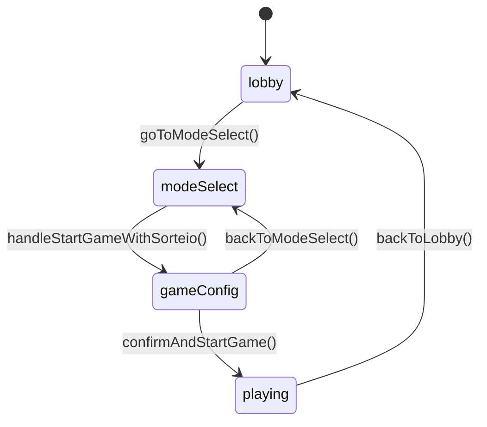

# Design Document - Game Configuration Screen

## Overview

Este documento descreve o design técnico da tela de configuração de partida (GameConfigScreen) que será inserida no fluxo do jogo online entre a seleção de modo e o início da partida. A tela permitirá que o host configure parâmetros importantes como quantidade de impostores e sistema de dicas, mantendo total consistência visual com o design existente do lobby.

## Architecture

### Component Hierarchy

```
ImpostorGame (Main Component)
├── LobbyScreen
├── ModeSelectScreen
├── GameConfigScreen (NEW)
│   ├── ConfigHeader
│   ├── ImpostorCountControl
│   ├── HintSystemToggles
│   ├── ConfigSummary
│   └── StartGameButton
├── PalavraSuperSecretaSubmodeScreen
└── GameScreen
```

### State Flow



### Data Flow

```
User Action (GameConfigScreen)
    ↓
Local State Update (useState)
    ↓
Confirm Button Click
    ↓
Collect Config Object
    ↓
Call startGame() with config
    ↓
API Request to /api/rooms/{code}/start
    ↓
Backend processes config
    ↓
WebSocket broadcasts room update
    ↓
All clients receive update
    ↓
Status changes to 'playing'
```

## Components and Interfaces

### 1. GameStore Updates

**File:** `client/src/lib/gameStore.ts`

#### New Type: GameConfig

```typescript
export type GameConfig = {
  impostorCount: number;
  enableHints: boolean;
  firstPlayerHintOnly: boolean;
};
```

#### Updated GameStatus Type

```typescript
export type GameStatus = 
  | 'home' 
  | 'lobby' 
  | 'modeSelect' 
  | 'gameConfig'  // NEW
  | 'submodeSelect' 
  | 'spinning' 
  | 'playing';
```

#### Updated GameState Interface

```typescript
export type GameState = {
  // ... existing fields
  gameConfig: GameConfig | null;  // NEW
  
  // ... existing methods
  goToGameConfig: () => void;  // NEW
  backToModeSelect: () => void;  // NEW
  startGameWithConfig: (config: GameConfig, themeCode?: string) => Promise<void>;  // NEW
};
```

#### New Store Methods

```typescript
goToGameConfig: () => {
  set({ status: 'gameConfig' });
},

backToModeSelect: () => {
  set({ status: 'modeSelect' });
},

startGameWithConfig: async (config: GameConfig, themeCode?: string) => {
  const { room, selectedMode } = get();
  if (!room || !selectedMode) return;

  try {
    const requestBody: any = { 
      gameMode: selectedMode,
      gameConfig: config  // NEW
    };
    
    // Handle submodes and theme codes as before
    if (selectedMode === 'palavraSecreta') {
      const submode = localStorage.getItem('selectedSubmode');
      if (submode) requestBody.selectedSubmode = submode;
      if (themeCode?.trim()) requestBody.themeCode = themeCode.trim().toUpperCase();
    }
    
    if (selectedMode === 'palavraComunidade' && themeCode?.trim()) {
      requestBody.themeCode = themeCode.trim().toUpperCase();
    }

    const response = await fetch(`/api/rooms/${room.code}/start`, {
      method: 'POST',
      headers: { 'Content-Type': 'application/json' },
      body: JSON.stringify(requestBody),
    });

    if (!response.ok) throw new Error('Failed to start game');
  } catch (error) {
    console.error('Error starting game:', error);
  }
},
```

### 2. GameConfigScreen Component

**File:** `client/src/pages/ImpostorGame.tsx` (add new component)

#### Component Structure

```typescript
const GameConfigScreen = () => {
  const { 
    room, 
    user, 
    selectedMode, 
    backToModeSelect, 
    startGameWithConfig 
  } = useGameStore();
  
  const { toast } = useToast();
  const [isStarting, setIsStarting] = useState(false);
  
  // Configuration state
  const [impostorCount, setImpostorCount] = useState(1);
  const [enableHints, setEnableHints] = useState(true);
  const [firstPlayerHintOnly, setFirstPlayerHintOnly] = useState(false);
  
  // Get theme code if needed
  const [selectedThemeCode, setSelectedThemeCode] = useState<string | null>(null);
  
  const isHost = room && user && room.hostId === user.uid;
  
  // ... component logic
};
```

#### Props Interface

```typescript
// No props needed - uses global store
```

#### State Management

```typescript
// Local state for configuration
const [impostorCount, setImpostorCount] = useState(1);
const [enableHints, setEnableHints] = useState(true);
const [firstPlayerHintOnly, setFirstPlayerHintOnly] = useState(false);
const [isStarting, setIsStarting] = useState(false);

// Derived state
const configSummary = useMemo(() => {
  let hintText = '';
  if (!enableHints) {
    hintText = 'O impostor jogará sem dicas (Modo Hardcore)';
  } else if (firstPlayerHintOnly) {
    hintText = 'O impostor só terá dica se começar a rodada';
  } else {
    hintText = 'O impostor terá acesso à dica';
  }
  return { impostorCount, hintText };
}, [impostorCount, enableHints, firstPlayerHintOnly]);
```

### 3. Sub-Components

#### CounterControl Component

```typescript
interface CounterControlProps {
  label: string;
  value: number;
  onChange: (value: number) => void;
  min: number;
  max: number;
  icon?: React.ComponentType<{ size?: number; className?: string }>;
}

const CounterControl: React.FC<CounterControlProps> = ({
  label,
  value,
  onChange,
  min,
  max,
  icon: Icon
}) => {
  return (
    <div className="bg-slate-800 p-5 rounded-3xl border-4 border-slate-900 flex flex-col gap-4">
      <div className="flex items-center gap-3 text-slate-300 font-bold text-lg">
        {Icon && <Icon size={20} className="text-orange-500" />}
        {label}
      </div>
      <div className="flex items-center justify-between bg-slate-900 rounded-2xl p-2">
        <button
          onClick={() => onChange(Math.max(min, value - 1))}
          disabled={value <= min}
          className={cn(
            "w-14 h-14 flex items-center justify-center rounded-xl font-black text-2xl transition-all border-b-4",
            value <= min
              ? "bg-slate-800 border-slate-950 text-slate-600 cursor-not-allowed"
              : "bg-slate-700 border-slate-950 text-white hover:bg-slate-600 active:border-b-0 active:translate-y-1"
          )}
        >
          -
        </button>
        <span className="text-4xl font-black text-white w-16 text-center">
          {value}
        </span>
        <button
          onClick={() => onChange(Math.min(max, value + 1))}
          disabled={value >= max}
          className={cn(
            "w-14 h-14 flex items-center justify-center rounded-xl font-black text-2xl transition-all border-b-4",
            value >= max
              ? "bg-slate-800 border-slate-950 text-slate-600 cursor-not-allowed"
              : "bg-gradient-to-r from-orange-500 to-amber-500 border-orange-800 text-white hover:brightness-110 active:border-b-0 active:translate-y-1"
          )}
        >
          +
        </button>
      </div>
    </div>
  );
};
```

#### ToggleSwitch Component

```typescript
interface ToggleSwitchProps {
  label: string;
  subLabel?: string;
  checked: boolean;
  onChange: (checked: boolean) => void;
  disabled?: boolean;
}

const ToggleSwitch: React.FC<ToggleSwitchProps> = ({
  label,
  subLabel,
  checked,
  onChange,
  disabled = false
}) => {
  return (
    <div
      className={cn(
        "p-5 rounded-3xl border-4 transition-all duration-300",
        disabled
          ? "bg-slate-800/50 border-slate-900 opacity-50 cursor-not-allowed"
          : "bg-slate-800 border-slate-900 hover:border-slate-700"
      )}
    >
      <div className="flex items-center justify-between gap-4">
        <div className="flex-1">
          <div className={cn(
            "font-bold text-lg mb-1",
            disabled ? "text-slate-500" : "text-slate-200"
          )}>
            {label}
          </div>
          {subLabel && (
            <p className="text-sm text-slate-400 leading-snug">
              {subLabel}
            </p>
          )}
        </div>
        
        <button
          onClick={() => !disabled && onChange(!checked)}
          disabled={disabled}
          className={cn(
            "relative w-16 h-9 rounded-full transition-all duration-300 border-b-4 shrink-0",
            checked
              ? "bg-gradient-to-r from-emerald-500 to-green-500 border-emerald-800"
              : "bg-slate-600 border-slate-900"
          )}
        >
          <div
            className={cn(
              "absolute top-1 left-1 bg-white w-7 h-7 rounded-full transition-transform duration-300 shadow-lg flex items-center justify-center",
              checked ? "translate-x-7" : "translate-x-0"
            )}
          >
            {checked ? (
              <Check size={16} className="text-emerald-600" strokeWidth={3} />
            ) : (
              <X size={16} className="text-slate-600" strokeWidth={3} />
            )}
          </div>
        </button>
      </div>
    </div>
  );
};
```

## Data Models

### GameConfig Type

```typescript
type GameConfig = {
  impostorCount: number;        // 1-5
  enableHints: boolean;          // true/false
  firstPlayerHintOnly: boolean;  // true/false (only applies if enableHints is true)
};
```

### API Request Body

```typescript
// POST /api/rooms/{code}/start
{
  gameMode: GameModeType;
  gameConfig: {
    impostorCount: number;
    enableHints: boolean;
    firstPlayerHintOnly: boolean;
  };
  selectedSubmode?: string;  // for palavraSecreta
  themeCode?: string;        // for palavraComunidade or custom themes
}
```

### Room Update (WebSocket)

```typescript
// Existing Room type - no changes needed
// Backend will store gameConfig and use it during game initialization
```

## Error Handling

### Validation Rules

1. **Impostor Count Validation**
   - Must be between 1 and 5
   - Cannot exceed number of players - 1
   - Frontend enforces with disabled buttons
   - Backend validates before starting game

2. **Hint System Validation**
   - If `enableHints` is false, `firstPlayerHintOnly` is ignored
   - Frontend disables toggle when hints are off
   - Backend applies logic correctly

3. **Host-Only Actions**
   - Only host can access GameConfigScreen
   - Non-host players see waiting screen
   - Backend validates host status on API call

### Error Scenarios

```typescript
// Scenario 1: Not enough players for impostor count
if (room.players.length <= impostorCount) {
  toast({
    title: "Jogadores insuficientes",
    description: `Você precisa de pelo menos ${impostorCount + 1} jogadores para ${impostorCount} impostor(es)`,
    variant: "destructive"
  });
  return;
}

// Scenario 2: API request fails
try {
  await startGameWithConfig(config, themeCode);
} catch (error) {
  toast({
    title: "Erro ao iniciar",
    description: "Não foi possível iniciar a partida. Tente novamente.",
    variant: "destructive"
  });
  setIsStarting(false);
}

// Scenario 3: Not host trying to start
if (!isHost) {
  toast({
    title: "Acesso negado",
    description: "Apenas o host pode iniciar a partida",
    variant: "destructive"
  });
  return;
}
```

## Testing Strategy

### Unit Tests

1. **CounterControl Component**
   - Test increment/decrement functionality
   - Test min/max boundaries
   - Test disabled states
   - Test onChange callback

2. **ToggleSwitch Component**
   - Test toggle on/off
   - Test disabled state
   - Test onChange callback
   - Test visual states

3. **GameConfigScreen Component**
   - Test initial state
   - Test configuration changes
   - Test summary updates
   - Test start game flow
   - Test back navigation

### Integration Tests

1. **Navigation Flow**
   - Test: lobby → modeSelect → gameConfig → playing
   - Test: gameConfig → modeSelect (back button)
   - Test: Non-host cannot access gameConfig

2. **State Persistence**
   - Test: Config values persist when going back
   - Test: Config resets on new game
   - Test: Config clears on leave room

3. **API Integration**
   - Test: Config sent correctly to backend
   - Test: Error handling on API failure
   - Test: WebSocket updates received

### E2E Tests

1. **Full Game Flow**
   - Create room
   - Select mode
   - Configure game settings
   - Start game
   - Verify impostor receives correct hints

2. **Multi-Player Scenarios**
   - Host configures, other players wait
   - Host starts, all players enter game
   - Verify hint system works as configured

3. **Edge Cases**
   - Too many impostors for player count
   - Network disconnection during config
   - Host leaves during config

### Manual Testing Checklist

- [ ] Visual consistency with lobby design
- [ ] Responsive layout on mobile/tablet/desktop
- [ ] All buttons have proper hover/active states
- [ ] Animations are smooth
- [ ] Toast notifications appear correctly
- [ ] Config summary updates in real-time
- [ ] Back button works correctly
- [ ] Start button disabled when appropriate
- [ ] Non-host players see waiting screen
- [ ] Hint system works as configured in actual game

## Design Rationale

### Why Insert Between Mode Select and Game Start?

1. **User Flow**: Natural progression from choosing "what to play" to "how to play"
2. **Host Control**: Gives host final control before committing to game start
3. **Flexibility**: Allows different configurations without creating multiple game modes
4. **Reversibility**: Easy to go back and change mode if needed

### Why These Specific Configuration Options?

1. **Impostor Count**: Core game mechanic that affects difficulty and strategy
2. **Hint System**: Balances game difficulty for different skill levels
3. **First Player Hint**: Adds strategic depth and increases difficulty

### Why Follow Lobby Design?

1. **Consistency**: Users already familiar with the visual language
2. **Trust**: Consistent design builds user confidence
3. **Efficiency**: Reuse existing CSS patterns and components
4. **Maintenance**: Easier to maintain consistent codebase

### Why Local State Instead of Global Store?

1. **Temporary**: Config only matters during setup phase
2. **Isolation**: Doesn't affect other parts of the app
3. **Simplicity**: Easier to reset and manage
4. **Performance**: No unnecessary re-renders in other components

## Implementation Notes

### CSS Classes to Reuse

```css
/* Backgrounds */
.bg-[#1C202C]      /* Main background */
.bg-[#242642]      /* Card background */
.bg-slate-800      /* Secondary elements */
.bg-slate-900      /* Tertiary elements */

/* Borders */
.border-[#2f3252]  /* Main borders */
.border-slate-900  /* Secondary borders */
.border-4          /* Border width */

/* Rounded corners */
.rounded-[3rem]    /* Main containers */
.rounded-3xl       /* Cards */
.rounded-2xl       /* Buttons */

/* Shadows */
.shadow-2xl        /* Main shadow */
.shadow-lg         /* Secondary shadow */

/* Gradients */
.from-orange-500.to-amber-500    /* Primary actions */
.from-green-500.to-emerald-500   /* Success actions */
.from-purple-500.to-violet-500   /* Special actions */

/* Transitions */
.transition-all.duration-300     /* Smooth transitions */

/* 3D Effect */
.border-b-[6px]                  /* Bottom border for 3D */
.active:border-b-0               /* Remove on press */
.active:translate-y-2            /* Move down on press */
```

### Accessibility Considerations

1. **Keyboard Navigation**: All interactive elements focusable
2. **Screen Readers**: Proper ARIA labels on toggles and counters
3. **Color Contrast**: Maintain WCAG AA standards
4. **Focus Indicators**: Visible focus states on all controls
5. **Touch Targets**: Minimum 44x44px for mobile

### Performance Considerations

1. **Memoization**: Use `useMemo` for derived state
2. **Debouncing**: Not needed - instant updates are fine
3. **Lazy Loading**: Component loaded only when needed
4. **Bundle Size**: Reuse existing components, no new dependencies

### Browser Compatibility

- Modern browsers (Chrome, Firefox, Safari, Edge)
- Mobile browsers (iOS Safari, Chrome Mobile)
- No IE11 support needed
- CSS Grid and Flexbox support required
